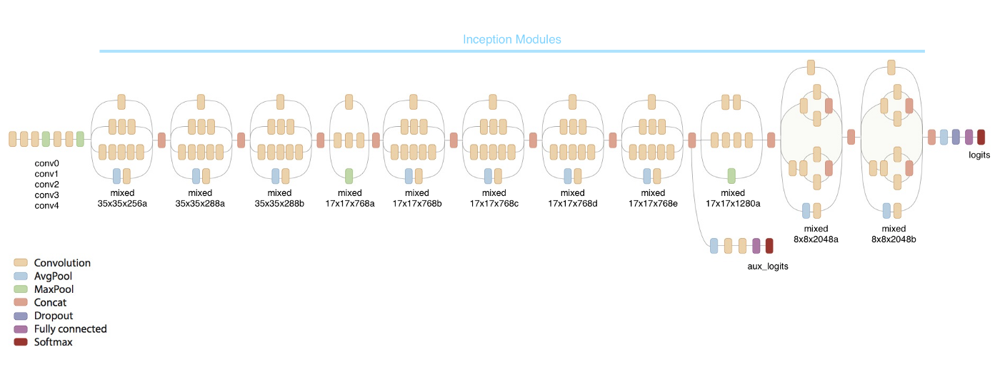

# Pneumonia-Diagnosis-using-XRays

# Motivation
 I  build an algorithm to detect a visual signal for pneumonia in medical images. Specifically, the algorithm  automatically locate lung opacities on chest radiographs.
 Pneumonia accounts for over 15% of all deaths of children under 5 years old internationally. In 2015, 920,000 children under the age of 5 died from the disease. In the United States, pneumonia accounts for over 500,000 visits to emergency departments [1] and over 50,000 deaths in 2015 [2], keeping the ailment on the list of top 10 causes of death in the country.

While common, accurately diagnosing pneumonia is a tall order. It requires review of a chest radiograph (CXR) by highly trained specialists and confirmation through clinical history, vital signs and laboratory exams. Pneumonia usually manifests as an area or areas of increased opacity [3] on CXR. However, the diagnosis of pneumonia on CXR is complicated because of a number of other conditions in the lungs such as fluid overload (pulmonary edema), bleeding, volume loss (atelectasis or collapse), lung cancer, or post-radiation or surgical changes. Outside of the lungs, fluid in the pleural space (pleural effusion) also appears as increased opacity on CXR. When available, comparison of CXRs of the patient taken at different time points and correlation with clinical symptoms and history are helpful in making the diagnosis.
CXRs are the most commonly performed diagnostic imaging study. A number of factors such as positioning of the patient and depth of inspiration can alter the appearance of the CXR [4], complicating interpretation further. In addition, clinicians are faced with reading high volumes of images every shift.
To improve the efficiency and reach of diagnostic services, the Radiological Society of North America (RSNA®) has reached out to Kaggle’s machine learning community and collaborated with the US National Institutes of Health, The Society of Thoracic Radiology, and MD.ai to develop a rich dataset for this challenge.
They see the potential for ML to automate initial detection (imaging screening) of potential pneumonia cases in order to prioritize and expedite their review.

# Arhitecture
 In this task I use  Inception V3  like base model to construct a personalized model capable to predict  pneumonia in medical images.
 When we consider classifying images, we often opt to build our model from scratch for the best fit, we say. This is an option but building a custom deep learning model demands extensive computation resources and lots of training data. Moreover, there already exists models that perform pretty well in classifying images from various categories. You have probably heard of ImageNet, and its Large Visual Recognition Challenge. In this Computer Vision challenge, models try to classify a huge collection of images into 1000 classes, like “Zebra”, “Dalmatian”, and “Dishwasher”. Inception V3 is the model Google Brain Team has built for the same. Needless to say, the model performed very well.

### InceptionV3 Architecture for Transfer Learning.

So, can we take advantage of the existence of this model for a custom image classification task like the present one? Well, the concept has a name: Transfer learning. It may not be as efficient as a full training from scratch, but is surprisingly effective for many applications. It allows model creation with significantly reduced training data and time by modifying existing rich deep learning models.

